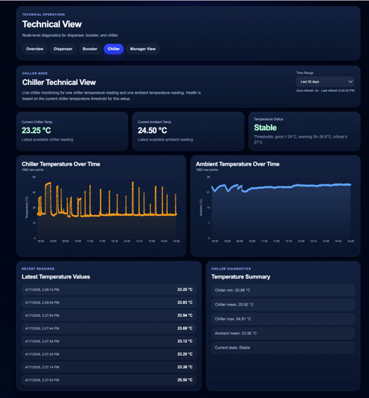

# IoT Beverage Dispensing and Monitoring System

> **University of Louisville — CSE 596 Capstone Project (Spring 2026)**
> Industry Partner: **Multiplex Beverage**
> Team: Alexander Lain · Roxana Perez Gonzalez · Karim Abdelfattah · Nathan Coffee · Robert Meyer
>
> 🏆 **1st Place — UofL Engineering Design & Innovation Showcase 2026**

---

## Overview

A wireless IoT diagnostic platform for commercial beverage dispensers. Three sensor nodes transmit real-time telemetry over LoRa radio to a Raspberry Pi gateway, where data is stored in InfluxDB and served through a Node.js backend to a React dashboard for real-time visualization.

Built as a senior capstone for a real industry client, Multiplex Beverage, addressing the lack of real-time visibility into machine health across restaurant, stadium, and retail deployments.

---

## How It Started — Proving the Radio Link

Before writing any sensor code, the first milestone was confirming that two **Heltec WiFi LoRa 32 V3** boards could actually talk to each other over LoRa.

This was done using the factory pingpong example from Heltec, then split into dedicated sender and receiver sketches. One board transmitted a `HelloWorld_<seq>` packet every few seconds; the other received it and displayed the message on its onboard OLED along with RSSI and SNR. Once both OLEDs were showing the correct packets in real time, the radio link was confirmed.

Those early development sketches are not included in this repository, but they were the foundation everything else was built on.

---

## System Architecture



```
[Dispenser Node]     [Chiller Node]     [Booster Node]
 Heltec LoRa32 V3    Heltec LoRa32 V3   Heltec LoRa32 V3
 + Qwiic Button      + MCP9600 TC AMP   + ACS723 + DC Motor
       |                   |                   |
       +------- LoRa RF (915 MHz) ------------+
                               |
                  [Raspberry Pi 4 Gateway]
                       SX1262 LoRa HAT
                       Python receiver
                       InfluxDB (time-series)
                               |
                  [Node.js + Express Backend]
                       REST API
                               |
                  [React Dashboard]
                   Manager View + Technical View
```

All communication is **star topology** — every node transmits directly to the Pi. The Pi receives packets and writes data to InfluxDB. The Node.js backend queries InfluxDB and serves data to the React frontend.

---

## Hardware

| Component | Role |
|---|---|
| Heltec WiFi LoRa 32 V3 (×3) | ESP32-S3 + SX1262 radio, one per node |
| SparkFun Qwiic Button | Dispense event detection (Dispenser Node) |
| Adafruit MCP9600 thermocouple amp | Temperature sensing (Chiller Node) |
| K-type thermocouple | Physical temperature probe |
| ACS723 current sensor | Pump current monitoring (Booster Node) |
| DC motor | Simulated pump (Booster Node) |
| Raspberry Pi 4 | Gateway: receives LoRa packets and writes to InfluxDB |
| SX1262 LoRa HAT | Radio interface on the Pi |

**LoRa Radio Config (all nodes + gateway must match):**

| Parameter | Value |
|---|---|
| Frequency | 915 MHz |
| Bandwidth | 125 kHz |
| Spreading Factor | 7 |
| Coding Rate | 4/5 |
| Sync Word | 0x12 |
| TX Power | 10 dBm |
| Preamble | 8 |

---

## Repository Structure

```
IoT-Beverage-Monitoring-System/
|
|-- firmware/                                # Arduino sketches (Heltec WiFi LoRa 32 V3)
|   |-- DispenserTransmissionTest1/
|   |   |-- DispenserTransmissionTest1.ino   # Dispenser Node: button timing + volume + LoRa TX
|   |-- BoosterTransmission/
|   |   |-- BoosterTransmission.ino          # Booster Node: ACS723 current/power + LoRa TX
|   |-- chillerTransmitter/
|       |-- chillerTransmitter.ino           # Chiller Node: MCP9600 temperature + LoRa TX
|
|-- pi-gateway/
|   |-- LoRaReceiver_InfluxSender.py         # Raspberry Pi 4 LoRa receiver + InfluxDB writer
|
|-- dashboard/                               # React dashboard + Node.js/Express API
|   |-- server/server.js                     # REST API that queries InfluxDB
|   |-- src/                                 # React app (Manager View + Technical View)
|   |-- README.md                            # Dashboard setup
|
|-- docs/images/system-architecture.png
|-- README.md
```

---

## Firmware — Node Sketches Explained

### Development milestones

Before the production sketches below, the dispenser logic was built up in small test sketches (not included in this repository):

1. **Qwiic Button detection.** Because the Heltec V3's OLED uses the internal I2C bus, a second I2C bus was created on GPIO 41 (SDA) and GPIO 42 (SCL) using `TwoWire(1)`, and the SparkFun Qwiic Button was confirmed at address `0x6F`.
2. **Press timing.** `millis()` records press start and release to compute each press duration and a cumulative total.
3. **Volume estimation.** Press duration is converted to ounces using the flow rates provided by Multiplex Beverage:
   - Syrup: 0.5 oz/sec (0.0005 oz/ms)
   - Water: 2.5 oz/sec (0.0025 oz/ms)
   - Total drink: 3.0 oz/sec (0.0030 oz/ms)

### `firmware/DispenserTransmissionTest1/DispenserTransmissionTest1.ino`

Production dispenser firmware. Combines the button timing and volume math, then transmits a structured LoRa payload using **RadioLib** on button release. The packet is prefixed with `D,` so the Pi gateway can identify it as a dispenser packet.

```
D,count=3,duration=1240i,syrup=0.620,water=3.100,total=3.720
```

### `firmware/BoosterTransmission/BoosterTransmission.ino`

Production booster firmware. Samples an **ACS723** current sensor on the pump circuit (with a zero-current calibration at startup), derives power from a 12 V supply, and transmits over LoRa using RadioLib. Prefixed with `B,`.

```
B,count=104,current=1.820,power=21.840,temp=22.10,pressure=0.00
```

### `firmware/chillerTransmitter/chillerTransmitter.ino`

Production chiller firmware. Reads from an **Adafruit MCP9600** thermocouple amplifier over I2C (same GPIO 41/42 second bus). Takes a 5-sample average with 50 ms spacing to smooth thermocouple noise, then transmits over LoRa using RadioLib. Prefixed with `C,`.

```
C,count=7,temp=4.23,ambient=22.15
```

> **Note on RadioLib vs Heltec stack:** Early test sketches used the Heltec LoRaWAN library (`LoRaWan_APP.h`). Production firmware migrated to **RadioLib** because it gives direct LoRa packet control without the overhead or session requirements of LoRaWAN. The Pi gateway also communicates via raw LoRa packets, not LoRaWAN, which is why they are compatible.

---

## Pi Gateway

### `pi-gateway/LoRaReceiver_InfluxSender.py`

Runs on the Raspberry Pi 4 and talks to the SX1262 LoRa HAT over direct SPI using `spidev` and `lgpio`. When a packet arrives, the prefix identifies the node:

- `C,` → `chiller_v2`
- `B,` → `booster_v2`
- `D,` → `dispenser_v2` (also queries InfluxDB with Flux for the last syrup level and appends `syrupRemaining`)

Payloads are written directly as InfluxDB line protocol fields, so each metric is stored as a native typed field.

---

## InfluxDB Structure

| Setting | Value |
|---|---|
| Bucket | Multiplex_Data_Capstone |
| Chiller Measurement | chiller_v2 |
| Booster Measurement | booster_v2 |
| Dispenser Measurement | dispenser_v2 |
| Tag | device=SX1262 |

**Fields per measurement:**
- `chiller_v2`: temp, ambient, count
- `booster_v2`: count, current, power, temp, pressure
- `dispenser_v2`: count, duration, water, syrup, total, syrupRemaining

**Example line protocol entry:**
```
dispenser_v2,device=SX1262 duration=1200i,water=4.5,syrup=1.2,total=5.7,syrupRemaining=94
```

---

## Running the Gateway

```bash
# Set your InfluxDB token as an environment variable (never hardcode it)
export INFLUX_TOKEN="your_influxdb_token_here"

# Activate the virtual environment
source /path/to/CapstoneEnv/bin/activate

# Run the receiver
python3 pi-gateway/LoRaReceiver_InfluxSender.py
```

---

## Running the Dashboard

The React dashboard and its Node.js/Express API live in `dashboard/`. The API reads its InfluxDB settings from environment variables (`INFLUX_URL`, `INFLUX_TOKEN`, `INFLUX_ORG`, `INFLUX_BUCKET`, and the three measurement names). See [`dashboard/README.md`](dashboard/README.md) for setup.

---

## Libraries Required

### Arduino (install via Library Manager)

| Library | Used In |
|---|---|
| RadioLib | Production firmware (SX1262 LoRa driver) |
| Adafruit SSD1306 | OLED display on production nodes |
| Adafruit GFX | Dependency of Adafruit SSD1306 |
| Adafruit MCP9600 | chillerTransmitter |
| SparkFun Qwiic Button | DispenserTransmissionTest1 |

### Python (Pi gateway)

```bash
pip install spidev lgpio requests
```

---

## Board Setup (Arduino IDE)

Target board: **Heltec WiFi LoRa 32 V3**

1. Add Heltec board package URL in Arduino IDE preferences:
   `https://github.com/Heltec-Aaron-Lee/WiFi_Kit_series`
2. Install **Heltec ESP32 Series Dev-boards** from Boards Manager
3. Select board: `WiFi LoRa 32(V3)`
4. Upload speed: `921600`

---

## Project Status

- [x] LoRa pingpong link confirmed between two nodes
- [x] Qwiic Button I2C detection on external bus (GPIO 41/42)
- [x] Press duration timing and cumulative tracking
- [x] Dispenser volume estimation from press duration + client flow rates
- [x] LoRa TX from Dispenser Node (RadioLib)
- [x] MCP9600 temperature reading with 5-sample smoothing
- [x] LoRa TX from Chiller Node (RadioLib)
- [x] Booster Node firmware (ACS723 current sensing + power derivation)
- [x] Pi bare receiver working
- [x] Pi InfluxDB writer working (LoRaReceiver_InfluxSender.py)
- [x] Node.js + Express backend with REST API
- [x] React dashboard with Manager View and Technical View
- [x] End-to-end integration confirmed

---

## Team

Alexander Lain · Roxana Perez Gonzalez · **Karim Abdelfattah** · Nathan Coffee · Robert Meyer

University of Louisville, J.B. Speed School of Engineering — CSE 596 Capstone, Spring 2026

**Karim Abdelfattah** — Embedded firmware, Dispenser Node, Booster Node, Pi gateway scripts
[LinkedIn](https://www.linkedin.com/in/karimabdelfattah7)
